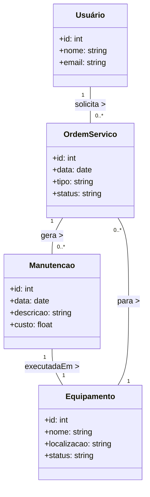
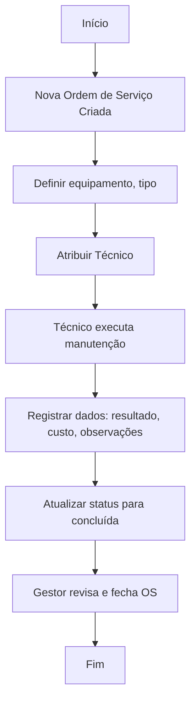

# Sistema de Gestão de Manutenção (Formativa)

# Briefing

## Visão Geral do Projeto
O projeto consiste no desenvolvimento de um Sistema de Gestão de Manutenção (SGM) no formato de uma aplicação web. O objetivo é centralizar e otimizar o controle das atividades de manutenção de máquinas e equipamentos de uma empresa. A plataforma permitirá o cadastro de equipamentos, agendamento de manutenções preventivas e corretivas, e o gerenciamento de ordens de serviço.


## Escopo

- ### Objetivos:
    - Centralizar Informações: Unificar os dados sobre equipamentos e manutenções em um único local.
    - Otimizar Processos: Agilizar a abertura, atribuição e finalização de ordens de serviço.
    - Melhorar a Tomada de Decisão: Fornecer um histórico detalhado de manutenções por equipamento para análises futuras.
    - Aumentar a Produtividade: Reduzir o tempo de inatividade dos equipamentos através de um gerenciamento mais eficaz.
    - Garantir a Segurança: Proteger o acesso e os dados do sistema com autenticação moderna e segura.

- ### Público-Alvo:
    - Técnicos de Manutenção: Responsáveis pela execução e atualização das ordens de serviço.
    - Gestores de Manutenção: Encarregados de planejar, delegar e supervisionar as atividades de manutenção.
    - Administradores do Sistema: Responsáveis pela gestão de usuários e permissões.

- ### Recursos Tecnológicos:


## Diagramas (Mermaid, Miro, Draw.io)

### Diagrama de Classe





### Diagrama de Casos de Uso


```mermaid
usecaseDiagram
    actor Gestor
    actor Tecnico
    actor Administrador

    Gestor --> (Cadastrar Equipamento)
    Gestor --> (Agendar Manutenção Preventiva)
    Gestor --> (Criar Ordem de Serviço)
    Gestor --> (Visualizar Histórico de Equipamento)

    Tecnico --> (Visualizar Ordens de Serviço)
    Tecnico --> (Executar Manutenção)
    Tecnico --> (Atualizar Status de Ordem)

    Administrador --> (Gerenciar Usuários)
    Administrador --> (Configurar Permissões)

```


### Diagrama de Fluxo




 
## Análise de Risco


## Prototipagem


## Codificação

